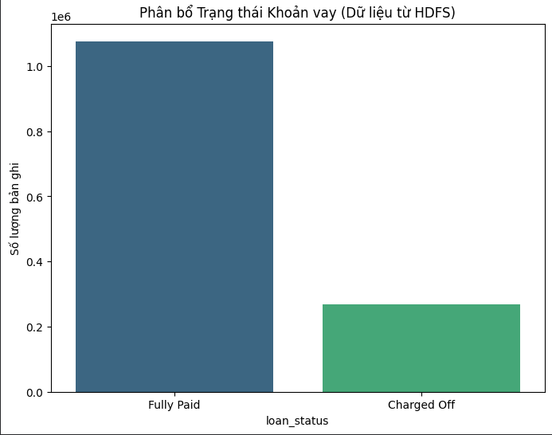
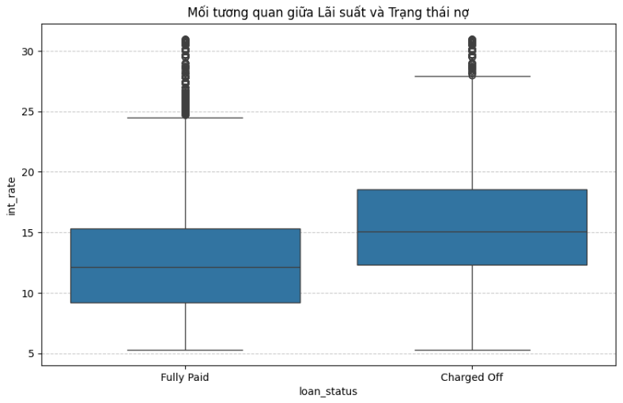
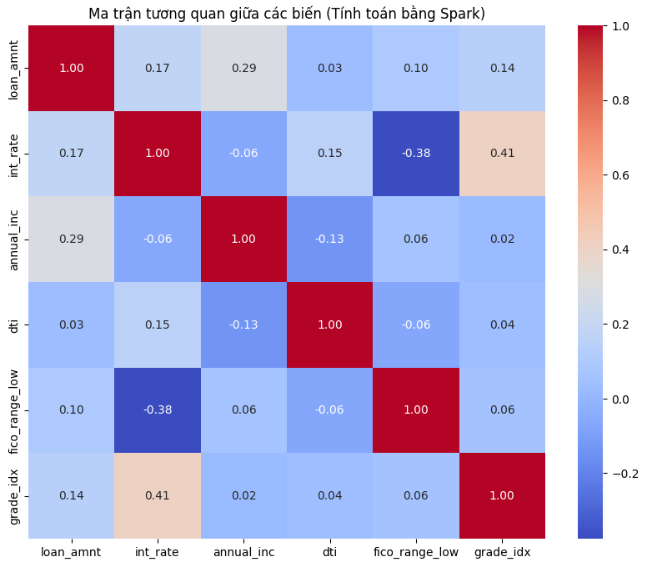
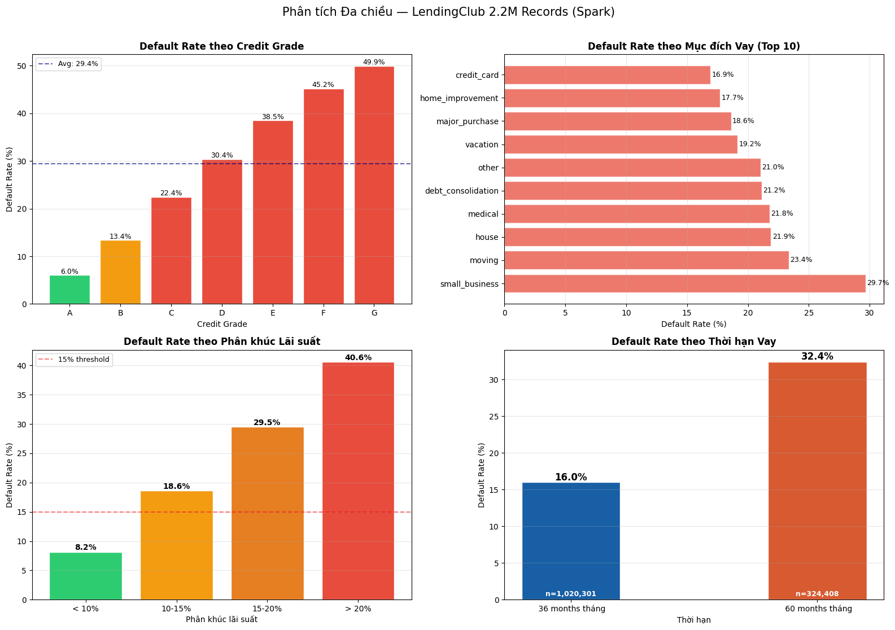
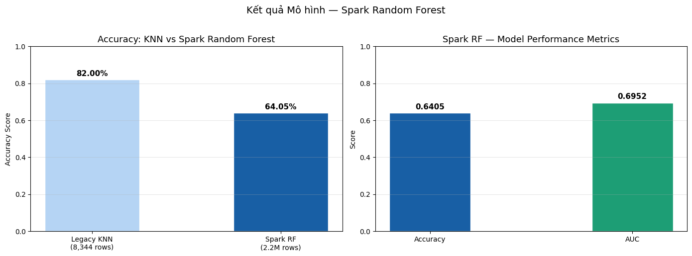
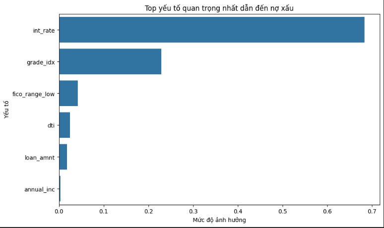
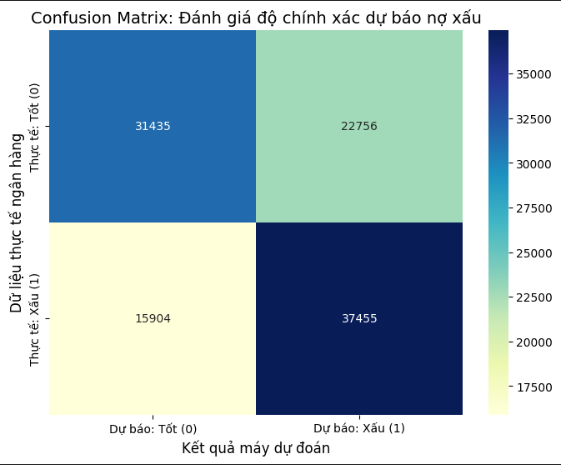
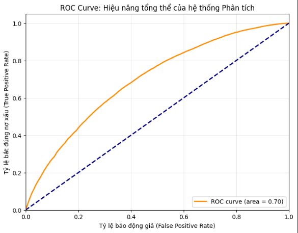

# Bank Loan Default Prediction

Predicting bank loan defaults using the LendingClub dataset. This project evolved from a local-scale KNN model to a Scalable Big Data Pipeline using Apache Spark and Hadoop HDFS, handling over 2.2 million records with advanced Class Imbalance Handling.

---

## Project Evolution: From Local to Big Data

Initially, a KNN model on Pandas could only handle 8k rows. To process the full **1.55GB dataset**, I built a distributed architecture:

| Component | Technology | Role |
|:---|:---|:---|
| Storage | Hadoop HDFS | Distributed data ingestion |
| Processing | Apache Spark (PySpark) | Parallelized transformation |
| Analysis | **Spark SQL** | Multi-dimensional EDA & querying |
| Model | Random Forest Classifier | Scalable classification |
| Balancing | Undersampling (80/20 → 50/50) | Class imbalance handling |

## Dataset & Infrastructure

- **Source:** [LendingClub Dataset on Kaggle](https://www.kaggle.com/datasets/wordsforthewise/lending-club)
- **Raw Scale:** 2,260,668 records (~1.55GB CSV file)
- **Balanced Dataset:** ~537k records after cleaning & Undersampling (50/50 Good vs. Bad loans)

## Why KNN and Random Forest?

1. **K-Nearest Neighbors (KNN) — The Baseline**
   - Limitation: O(n²) complexity — impossible to scale to 2.2M rows on a single machine
   - Lesson: This bottleneck was the primary driver for migrating to Apache Spark

2. **Random Forest — The Scalable Solution**
   - Distributed: Spark trains different trees on different executors simultaneously
   - Handles Non-Linearity: Captures complex interactions (e.g., Interest Rate × Credit Grade)
   - Optimized: `cacheNodeIds=True`, `checkpointInterval=10`, `subsamplingRate=0.7`

## Technical Stack

- **Big Data:** Apache Spark 3.1.2, Hadoop 3.2
- **Analysis:** Spark SQL (`createOrReplaceTempView`, aggregations)
- **Machine Learning:** `pyspark.ml` — VectorAssembler, RandomForestClassifier, StringIndexer
- **Visualization:** Seaborn, Matplotlib
- **Environment:** Google Colab with Java 8 & HDFS configured

---

## SQL Analysis — Querying 2.2M Records

Using **Spark SQL** to extract multi-dimensional insights:

```sql
-- Default rate by Credit Grade
SELECT grade, COUNT(*) AS total_loans,
       ROUND(SUM(CASE WHEN loan_status = 'Charged Off' THEN 1 ELSE 0 END)
             * 100.0 / COUNT(*), 2) AS default_rate_pct
FROM loans_binary GROUP BY grade ORDER BY grade;
```

```sql
-- Risk segmentation by Interest Rate
SELECT
    CASE WHEN int_rate < 10  THEN 'Low (< 10%)'
         WHEN int_rate < 15  THEN 'Medium (10-15%)'
         WHEN int_rate < 20  THEN 'High (15-20%)'
         ELSE 'Very High (> 20%)' END AS risk_segment,
    COUNT(*) AS total_loans,
    ROUND(SUM(CASE WHEN loan_status = 'Charged Off' THEN 1 ELSE 0 END)
          * 100.0 / COUNT(*), 2) AS default_rate_pct
FROM loans_binary GROUP BY risk_segment ORDER BY default_rate_pct;
```

```sql
-- Default rate by Loan Purpose
SELECT purpose, COUNT(*) AS total_loans,
       ROUND(SUM(CASE WHEN loan_status = 'Charged Off' THEN 1 ELSE 0 END)
             * 100.0 / COUNT(*), 2) AS default_rate_pct
FROM loans_binary GROUP BY purpose HAVING COUNT(*) > 1000
ORDER BY default_rate_pct DESC;
```

---

## Key Insights & Visualizations (EDA)

### 1. Class Imbalance Challenge

<p align="center">

</p>

The raw dataset is heavily imbalanced: **~1.07M "Fully Paid"** vs **~268K "Charged Off"** — roughly an **80/20 split**. Training a model directly on this data would result in it simply predicting "Fully Paid" for every case, achieving high accuracy but completely failing to detect actual defaults. This imbalance was resolved using **Undersampling**, reducing the majority class to match the minority and producing a balanced 50/50 training set.

---

### 2. Interest Rate as a Default Signal

<p align="center">

</p>

The boxplot reveals a clear separation between the two groups. "Fully Paid" loans have a **median interest rate of ~12%**, while "Charged Off" loans sit noticeably higher at **~15%**. The interquartile range (IQR) of defaulted loans is also wider and shifted upward, indicating that high-rate borrowers consistently carry more risk. This single chart justifies the **15% threshold** used in the business recommendation — it is not an arbitrary number but a data-driven boundary between the two distributions.

---

### 3. Feature Correlations

<p align="center">

</p>

Computed by Spark MLlib across all 2.2M records, the correlation matrix highlights three important relationships:

- **`int_rate` ↔ `grade_idx`: r = 0.41** — The strongest pair-wise correlation in the dataset. Higher-grade loans (worse credit) are systematically assigned higher interest rates, confirming these two features carry overlapping but complementary information.
- **`int_rate` ↔ `fico_range_low`: r = −0.38** — A meaningful negative correlation. Borrowers with higher FICO scores receive lower interest rates, which is expected — but the magnitude confirms FICO is a relevant risk signal.
- **`loan_amnt` ↔ `annual_inc`: r = 0.29** — Higher-income borrowers tend to take out larger loans, a logical relationship that confirms data integrity.
- Most other pairs show near-zero correlation, indicating the 6 selected features contribute largely **independent** information to the model — a good sign for Random Forest performance.

---

### 4. Multi-dimensional EDA — Default Rate Across 4 Dimensions

<p align="center">

</p>

This panel uses Spark SQL to compute default rates across four business-relevant dimensions simultaneously on 2.2M records:

**Top-left — Default Rate by Credit Grade (A → G):**
Grade is one of the strongest risk stratifiers in the dataset. Grade A borrowers default at only **6.0%**, barely above background noise. The rate climbs steadily through B (13.4%), C (22.4%), D (30.4%), before accelerating sharply at E (38.5%), F (45.2%), and peaking at G with **49.9%** — nearly a coin flip. The average across all grades is 29.4% (dashed line). Grades E, F, and G all sit well above this average, supporting the business recommendation to flag these grades automatically regardless of other factors.

**Top-right — Default Rate by Loan Purpose (Top 10):**
`credit_card` and `home_improvement` are the safest purposes at 16.9% and 17.7% respectively — borrowers using credit for specific, tangible goals tend to repay more reliably. `debt_consolidation` sits in the middle at 21.2%, which is notable given it is by far the most common loan purpose in the dataset. `moving` (23.4%) and `small_business` (29.7%) are the riskiest categories. Small business loans default at nearly twice the rate of credit card loans — reflecting the inherent uncertainty of business cash flows compared to personal obligations.

**Bottom-left — Default Rate by Interest Rate Segment:**
The risk gradient across interest rate bands is steep and consistent. Loans under 10% default at just **8.2%**, while those between 10–15% rise to 18.6%. Crossing the 15% threshold (dashed red line) marks a clear inflection point: the 15–20% band reaches **29.5%** and loans above 20% hit **40.6%** — five times the rate of the safest segment. This chart provides the quantitative foundation for the 15% threshold recommendation.

**Bottom-right — Default Rate by Loan Term (36 vs 60 months):**
Despite having far fewer borrowers (n=324,408 vs n=1,020,301), 60-month loans default at **32.4%** — more than double the 36-month rate of **16.0%**. Longer loan terms expose both borrower and lender to greater uncertainty: more time for income disruption, job loss, or economic downturns to intervene. This finding supports applying stricter underwriting criteria to 60-month applications.

---

## Model Performance: Spark Random Forest

### Final Metrics

| Metric | Value | Note |
|:---|:---|:---|
| Accuracy | 64.05% | Realistic on balanced 50/50 data |
| AUC (ROC) | 0.6952 | Strong predictive power for financial risk |
| Defaults detected | 37,455 cases | True Positives in test set |

### KNN vs. Spark Random Forest

<p align="center">

</p>

The left panel compares raw accuracy between the two approaches. The KNN model achieves 82% accuracy — but only on a 8,344-row sample and without any class balancing, meaning it is largely predicting the majority class. The Spark RF achieves 64.05% on a **balanced** 50/50 dataset of 2.2M records, which is a more honest and useful metric. The right panel confirms both Accuracy (0.6405) and AUC (0.6952) for the final model.

### Feature Importance

<p align="center">

&nbsp;&nbsp;

</p>

The feature importance chart confirms what the EDA already suggested: **`int_rate` dominates with ~0.68 importance**, far ahead of any other variable. `grade_idx` is second at ~0.23, together accounting for over 90% of the model's decision-making. `fico_range_low`, `dti`, `loan_amnt`, and `annual_inc` each contribute less than 5% individually — they provide marginal refinement but the model is primarily driven by interest rate and credit grade.

The confusion matrix on a balanced test set shows **37,455 True Positives** (defaults correctly caught) and **31,435 True Negatives** (good loans correctly approved). The model generates 22,756 False Positives (good loans flagged as risky) and 15,904 False Negatives (actual defaults missed). In a credit risk context, False Negatives are the more costly error — approving a loan that ultimately defaults. The model's recall on the default class is therefore the most business-critical metric to track and improve.

### ROC Curve

<p align="center">

</p>

The ROC curve plots True Positive Rate against False Positive Rate across all classification thresholds. The orange curve bows clearly above the diagonal baseline (AUC = 0.50, equivalent to random guessing), achieving **AUC = 0.70**. This means that given a randomly selected defaulted loan and a randomly selected good loan, the model correctly ranks the defaulted one as riskier 70% of the time — a meaningful and practically useful separation. The curve's steeper rise at low FPR values indicates the model is particularly effective when set to a conservative threshold, flagging only the highest-confidence defaults — which is the appropriate operating point for a lending institution seeking to minimize undetected risk.

---

## Data-Driven Insights & Business Recommendations

### 1. Interest Rate Risk Threshold (> 15%)
- **Insight:** `int_rate` is the #1 predictor (importance ~0.68). SQL segmentation confirms loans above 20% default at 40.6% — nearly 5× the rate of sub-10% loans.
- **Recommendation:** Implement mandatory manual review for any application with interest rate exceeding 15%.

### 2. Credit Grade Red Flag (E, F, G)
- **Insight:** Grades E, F, G default at 38.5%, 45.2%, and 49.9% respectively — all far above the 29.4% average.
- **Recommendation:** Automate a "Red Flag" alert for Grades E, F, and G regardless of income level.

### 3. Loan Term Risk (60 months vs 36 months)
- **Insight:** 60-month loans default at 32.4% vs 16.0% for 36-month — a 2× difference across 1.3M+ loans.
- **Recommendation:** Apply a higher interest buffer or require stronger collateral for 60-month applications.

### 4. Small Business Loan Caution
- **Insight:** `small_business` has the highest default rate among all loan purposes at 29.7%.
- **Recommendation:** Apply additional income verification and business cash-flow review for small business applications.

### 5. Model Reliability in Production
- **Insight:** AUC 0.70 far outperforms random chance (0.50). The model catches 37,455 true defaults in the test set.
- **Recommendation:** This Spark pipeline is ready for integration into a Loan Origination System (LOS) for real-time risk scoring.

---

## Big Data Optimization

Processing 2.2M rows in ~18 minutes through:

- **Strategic Caching:** `.cache()` prevents redundant full-data scans
- **Training Efficiency:** `subsamplingRate=0.7` reduces training time by 75%
- **Memory Optimization:** `maxMemoryInMB=1024`, `cacheNodeIds=True`
- **Checkpointing:** `checkpointInterval=10` frees memory every 10 trees
- **Parallel Execution:** 160× more data than the legacy KNN version

---

## Model Comparison: KNN vs. Spark Random Forest

| Feature | Legacy KNN Model | Spark Random Forest (Final) |
|:---|:---|:---|
| **Data Volume** | Sampled (**8,344 rows**) | **2.2M rows (Full)** |
| **Infrastructure** | Local CPU / Pandas | **Hadoop HDFS & Apache Spark** |
| **Analysis** | DataFrame only | **Spark SQL + MLlib** |
| **Class Handling** | None (Biased) | **Undersampling (Balanced 50/50)** |
| **Complexity** | O(n²) — Not scalable | O(Trees × n log n) — **Distributed** |
| **Accuracy** | 82.00% (8K rows) | **64.05% (2.2M rows)** |
| **Scalability** | Low (Memory limited) | **High** |

---

## Repository Structure

```
Bank-Loan-Default-Prediction/
├── notebook/
│   ├── Bank_Loan_Classification_Large_Scale_System.ipynb  ← Main pipeline
│   └── Legacy_KNN_Model.ipynb                             ← Baseline (8K rows)
├── images/          ← EDA & evaluation charts
├── requirements.txt
└── README.md
```

## How to Run

1. Open `notebook/Bank_Loan_Classification_Large_Scale_System.ipynb`
2. Click **"Open in Colab"**
3. **Runtime > Run all** (or `Ctrl+F9`)
4. No Kaggle API required — dataset fetched automatically from a public mirror

---

**Author:** Phuc Pham
