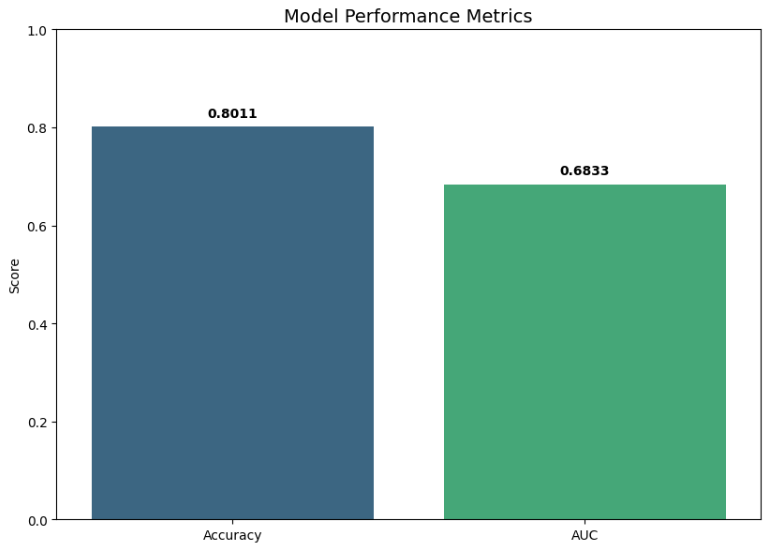

# Bank Loan Default Prediction (Big Data Edition)

Predicting bank loan defaults using the LendingClub dataset. This project evolved from a local-scale **KNN model** to a **Scalable Big Data Pipeline** using **Apache Spark** and **HDFS**, handling over 2.2 million records.

---

## Project Evolution: From Local to Big Data
Initially, this project started with a KNN model using Pandas on a small sample. However, to process the full **1.55GB dataset** without memory failures, the architecture was upgraded to a distributed system:
* **Storage:** Hadoop Distributed File System (HDFS) for reliable storage.
* **Processing Engine:** Apache Spark (PySpark) for parallelized data transformation.
* **Model:** Random Forest Classifier (Optimized for large-scale financial data).

## Dataset & Infrastructure
* **Source:** [LendingClub Dataset on Kaggle](https://www.kaggle.com/datasets/wordsforthewise/lending-club)
* **Raw Scale:** 2,260,668 records (~1.55GB CSV file).
* **Infrastructure:** * **HDFS:** Managed distributed data ingestion.
    * **PySpark:** Parallelized the training process across the entire cluster.
* **Processed Scale:** After cleaning and filtering for completed loans, the dataset contains **1,344,709 records**.
    * **Training Set:** 1,076,484 rows (80%)
    * **Test Set:** 268,225 rows (20%)

## Technical Stack
* **Big Data:** Apache Spark 3.1.2, Hadoop 3.2.
* **Machine Learning:** `pyspark.ml` (VectorAssembler, RandomForestClassifier, StringIndexer).
* **Visualization:** `Seaborn`, `Matplotlib`.
* **Environment:** Google Colab with Java 8 & HDFS configured.

## Key Insights & Visualizations (EDA)
Using Spark to process the entire dataset,  identified critical patterns that were previously limited in the KNN version:

### 1. The Scalability Gap (KNN vs. Spark)
* **KNN Limitation:** The original KNN model could only handle a **tiny sample of 8,344 rows**.
* **Spark Advantage:** Spark allowed us to scale to **1.34 Million records** (a **160x increase**), capturing the full variance of the data.

### 2. Class Distribution & Correlations
I analyzed the 80/20 imbalance between "Fully Paid" and "Charged Off" status. Spark's correlation matrix helped identify the most predictive features.

  
  

### 3. Feature Analysis: Interest Rate
Interest rate proved to be a primary "red flag". "Charged Off" loans typically carry significantly higher interest rates compared to "Fully Paid" ones.

  

---

## Model Performance: Spark Random Forest
I transitioned from  **KNN** to **Random Forest** for better stability on imbalanced big data.

### **Final Metrics:**
* **Accuracy:** **80.11%** * **AUC (Area Under ROC):** **0.6833**

### **Feature Importance:**
The model identified **Interest Rate (55.8%)** and **Credit Grade (35.3%)** as the top predictors.

  
  

---

## Model Comparison: KNN vs. Spark Random Forest

| Feature | Legacy KNN Model | Spark Random Forest (Final) |
| :--- | :--- | :--- |
| **Data Volume** | Sampled (**8,344 rows**) | **Full Dataset (1,344,709 rows)** |
| **Infrastructure** | Local CPU / Pandas | **Hadoop HDFS & Apache Spark** |
|**Complexity** | $O(n^2)$ - Not scalable | $O(Trees \times n \log n)$ - **Distributed** |
| **Accuracy** | 82.00% (Small sample) | **80.11% (Full 1.5GB Data)** |
| **Scalability** | Low (Memory limited) | **High (Production-ready)** |

---

## Repository Structure
* `notebook/`: 
    * `Bank_Loan_Classification_Large_Scale_System.ipynb` (Final Spark Pipeline).
    * `Legacy_KNN_Model.ipynb` (Initial approach on 8k rows).
* `images/`: Visualization charts for EDA and Model Evaluation.
* `README.md`: Project documentation.

## How to Run
1. Open the **Spark Notebook** in Google Colab.
2. Execute the Pipeline
   1. Open the **Spark Notebook** in Google Colab using the badge at the top.
   2. **Kaggle Authentication:** When prompted by the notebook, simply enter your:
       * **Kaggle Username**
       * **Kaggle API Key**
    3. **Environment Setup:** The notebook will automatically install Java 8, Spark, and Hadoop, then configure the HDFS environment.
    4. **Data Ingestion:** The code will download the 1.55GB dataset from Kaggle and move it to **HDFS** (`/user/{current_user}/data/loan_data.csv`).
    5. **Run All:** Execute all cells to witness the **80.11% accuracy** on over 1.3M rows.
3. Run all cells to initialize HDFS, Spark, and execute the pipeline.

---
**Author:** Phuc Pham  
