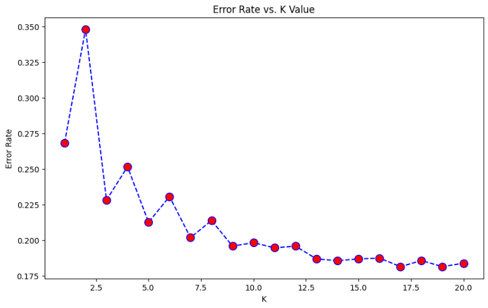
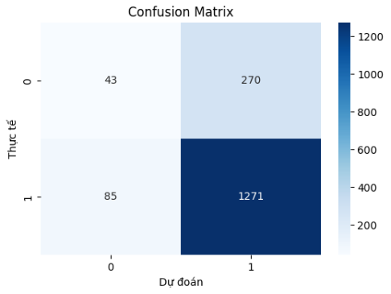
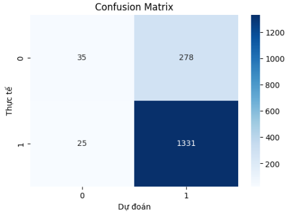

# Bank Loan Default Prediction
Predicting bank loan defaults using the LendingClub dataset. Features comprehensive EDA, big data preprocessing, and K-Nearest Neighbors (KNN) classification with hyperparameter tuning.

---

## Project Overview
The goal of this project is to build a machine learning model that can predict whether a borrower will pay back their loan in full or "Charge Off" (default). By identifying high-risk borrowers, financial institutions can minimize financial losses and optimize their lending strategies.

## Data Source & Big Data Handling
The dataset used is a subset of the **LendingClub Loan Data** from Kaggle.
* **Original Source:** [LendingClub Dataset on Kaggle](https://www.kaggle.com/datasets/wordsforthewise/lending-club)
* **Dataset Size:** 2.2 million+ records (~1.55GB CSV file).
* **Big Data Optimization:** Due to RAM limits, I implemented **Linux `!head` command** and **Pandas Chunking** to efficiently process the data. 
* **Reproducibility:** A sampled version (`data/loan_data_sample.csv`) is provided for users to run the notebook immediately without downloading the full 1.5GB dataset.

## 🛠️ Technical Stack
* **Language:** Python
* **Libraries:** `Pandas`, `NumPy`, `Matplotlib`, `Seaborn`, `Scikit-learn`.
* **Tools:** Google Colab, Linux Command Line.

## ⚙️ Key Features & Workflow
### 1. Exploratory Data Analysis (EDA)
* Analyzed the distribution of `loan_status` to identify class imbalance.
* Visualized correlations between features like `annual_inc`, `loan_amnt`, and `int_rate`.

### 2. Advanced Data Preprocessing
* **Outlier Removal:** Used the **Interquartile Range (IQR)** method to filter extreme values in income and debt-to-income (DTI) ratios.
* **Feature Engineering:** * Converted `term` (e.g., "36 months") into numeric format.
    * Encoded categorical `grade` (A-G) into ordinal numeric values.
* **Scaling:** Applied **StandardScaler** to normalize features, which is crucial for distance-based algorithms like KNN.

### 3. Modeling & Hyperparameter Tuning
* Implemented **K-Nearest Neighbors (KNN)**.
* Performed **Hyperparameter Tuning** using the **Elbow Method** (testing K from 1 to 20).
* **Optimization:** Improved accuracy from a baseline of **79% (K=5)** to **82% (K=17)**.

<p align="center">
  
</p>
<p align="center">
  <em>(Elbow Method Chart: Identifying K=17 as the optimal balance between bias and variance.)</em>
</p>

## Repository Structure
* `data/`: Contains the sampled dataset for demo (`loan_data_sample.csv`).
* `models/`: Contains trained `knn_model.pkl` and `scaler.pkl`.
* `notebook/`: Comprehensive Python Notebook with step-by-step explanations.
* `images/`: Visualization charts (Elbow Method, Confusion Matrices, etc.).
* `requirements.txt`: List of required Python libraries.

## Results & Model Evolution

### Confusion Matrix Comparison
We compare the performance of the Baseline Model ($K=5$) and the Optimized Model ($K=17$) after finding the optimal K-value using the Elbow Method.

<p align="center">
  
  &nbsp;&nbsp;&nbsp;&nbsp;&nbsp;&nbsp;&nbsp;
  
</p>
<p align="center">
  <em>(Left: Baseline $K=5$, Right: Optimized $K=17$)</em>
</p>
<p align="center">
  <em>Final Accuracy: 82% (Optimized K=17)</em>
</p>

### Key Insights from Comparison:
* **Accuracy Improvement:** Overall accuracy increased by **3%** (from 79% to **82%**).
* **Reduction of False Defaults:** The $K=17$ model significantly reduced the number of false default predictions (False Negatives), making it more reliable for financial institutions.
* **Balanced Performance:** Finding the optimal K balanced the bias-variance trade-off, leading to a more stable model.
## How to Run
1. Clone the repository:
   ```bash
   git clone [https://github.com/PhcPh4m/Bank-Loan-Default-Prediction.git](https://github.com/your-username/Bank-Loan-Default-Prediction.git)
2. Install dependencies: 
   ```bash
   pip install -r requirements.txt
3. Run the notebook in notebooks or upload it to Google Colab.
   
   
